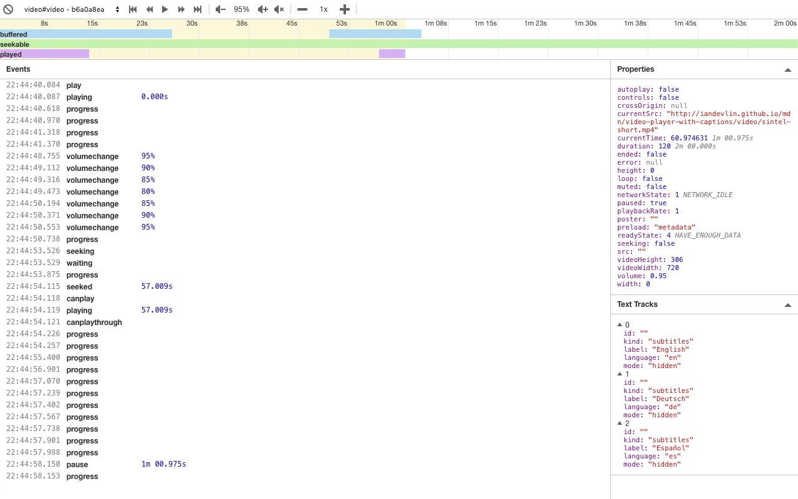

# Media Monitor


A browser extension for monitoring HTML5 media elements.



## Features
* support for tracking multiple media elements at once
* live media properties preview
* media events timeline
* additional media controls

and more!

## Available version
A [Chrome Extension](https://chrome.google.com/webstore/detail/media-monitor/jhmldnninjninhlnofnkoijkdkakelco) is currently available. Support for more browsers is coming soon!

## Upcoming features

* additional text tracks controls

## Development

Clone the repository and install dependencies with:

```
npm i
```

The tools is written in Vue.js and thus can be controlled with Vue CLI (when installed):

```
vue ui
```

Otherwise, you can use the following commands:

### Serve

```
npm run serve
```

A test page suitable for development can be found here: `tests/dev/index.html`.
It loads the tool that is served with the command above inside of an `<iframe>` element with some test content next to it.

### Build

```
npm run build
```

### Lint

```
npm run lint
```

### Test

```
npm run test:unit
```

## Licence

Copyright &copy; 2019 Gaupe Software

Permission is hereby granted, free of charge, to any person obtaining a copy
of this software and associated documentation files (the "Software"), to deal
in the Software without restriction, including without limitation the rights
to use, copy, modify, merge, publish, distribute, sublicense, and/or sell
copies of the Software, and to permit persons to whom the Software is
furnished to do so, subject to the following conditions:

The above copyright notice and this permission notice shall be included in all
copies or substantial portions of the Software.

THE SOFTWARE IS PROVIDED "AS IS", WITHOUT WARRANTY OF ANY KIND, EXPRESS OR
IMPLIED, INCLUDING BUT NOT LIMITED TO THE WARRANTIES OF MERCHANTABILITY,
FITNESS FOR A PARTICULAR PURPOSE AND NONINFRINGEMENT. IN NO EVENT SHALL THE
AUTHORS OR COPYRIGHT HOLDERS BE LIABLE FOR ANY CLAIM, DAMAGES OR OTHER
LIABILITY, WHETHER IN AN ACTION OF CONTRACT, TORT OR OTHERWISE, ARISING FROM,
OUT OF OR IN CONNECTION WITH THE SOFTWARE OR THE USE OR OTHER DEALINGS IN THE
SOFTWARE.